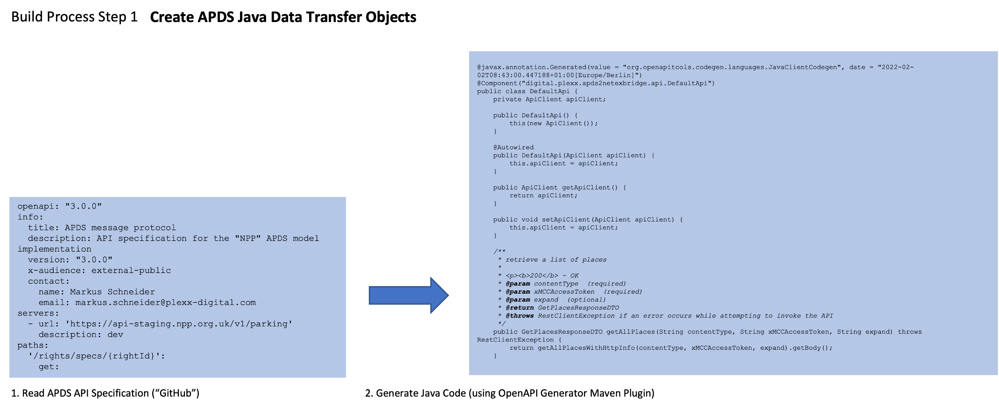
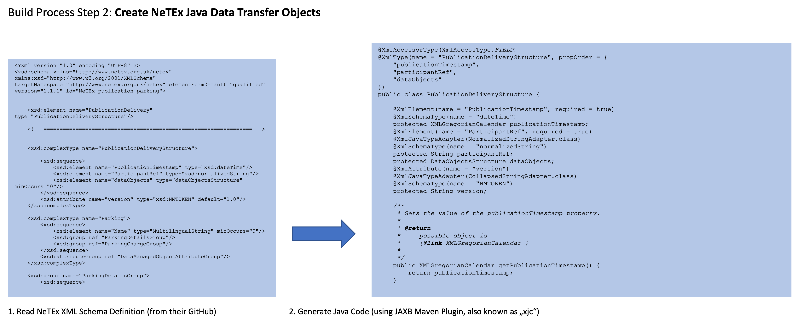
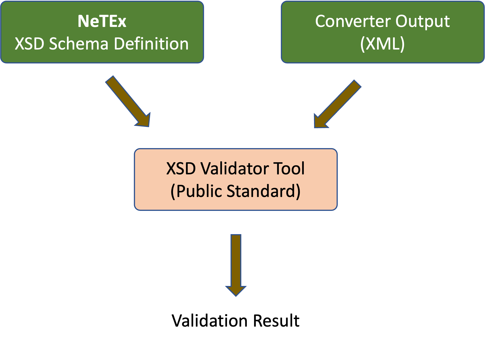
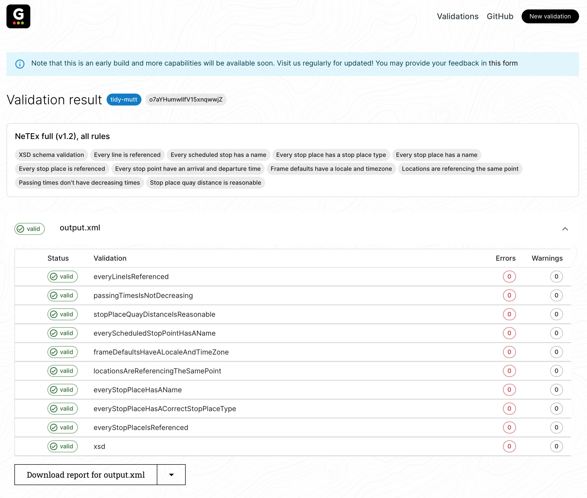

[](/LICENSE)
# apds2netex 
an Open-Source APDS-to-NeTEx Adapter

## Table of Contents
[Starting Point and Motivation](#starting-point-and-motivation)  
[Structure of this Document](#structure-of-this-document)  
[Reference Documents](#reference-documents)  
[License](#license)  
[Examples from the NeTEx Parking Profile Specification](#examples-from-the-netex-parking-profile-specification)  
[Mapping from APDS to NeTEx](#mapping-from-apds-to-netex)  
[&nbsp;&nbsp;&nbsp;&nbsp;&nbsp;Conceptual Aspects](#conceptual-aspects)  
[&nbsp;&nbsp;&nbsp;&nbsp;&nbsp;Mapping](#mapping)  
[Software Documentation](#software-documentation)  
[&nbsp;&nbsp;&nbsp;&nbsp;&nbsp;Project Artefacts](#project-artefacts)  
[&nbsp;&nbsp;&nbsp;&nbsp;&nbsp;Solution Architecture](#solution-architecture)  
[&nbsp;&nbsp;&nbsp;&nbsp;&nbsp;Result Validation](#validation-of-the-result)  
[&nbsp;&nbsp;&nbsp;&nbsp;&nbsp;Build Instructions](#build-instructions)  
[&nbsp;&nbsp;&nbsp;&nbsp;&nbsp;Command Line Utility](#command-line-utility)  
[&nbsp;&nbsp;&nbsp;&nbsp;&nbsp;Demo App Code Snippet](#demo-app-code-snippet)  

# Starting Point and Motivation
## Status and request for collaboration
The content described below provides an initial experimental approach to converting parking data between key standardised formats.  This provides potential tools to support the parking industry make its data available in a regularised manner, and meet some of the requirements that exist for data availability within the European Union. This specific instance of converter supports the conversion of data from APDS format to NeTEx format (see below for further explanation). 

> This converter is experimental and it is expected that a wider review of it will result in requests for improvements, additional documentation etc.  Such inputs are warmly welcomed.

## APDS
With the input of numerous parking industry professionals, the _Alliance for Parking Data Standards_ (https://www.allianceforparkingdatastandards.org) has created the APDS standard. The latest version of the standard specification is v4.0. The _Alliance_ also provides an accompanying APDS Messaging Specification (published on GitHub) to facilitate implementation work for APDS adopters. The APDS specifications also form the basis of ISO TS 5206-1:2023 _Parking – Core Data Model_, and the European CEN TS 15167-6:2022 _"DATEX II" Parking Publications_.

## NeTEx, NeTEx Parking Profile
There is a variety of other specifications covering selected aspects of transport and mobility. One such standard specification is Transmodel (EN 12896, http://www.transmodel-cen.eu ), the CEN reference data model for public transport. Transmodel is the basis for NeTEx (“Network Timetable Exchange”, http://netex-cen.eu ) which constitutes a CEN Technical Specification for exchanging public transport schedules and related data (CEN TS 16614-1, CEN TS 16614-2, CEN TS 16614-3).

There are some profiles using a subset of NeTEx. One of them created in France is “NeTEx – Profil Français pour les Parkings”. It is related to parking facilities as one important element in the greater scheme of transport modes. It originally was created to serve as a basis for 3rd parties who are mandated to fulfill the French LOM (Lois d’Orientation pour les Mobilités), a national regulation.

## APDS-to-NeTEx Adapter
The sheer number of mobility-related standards and specifications makes it difficult for potential adopters to select the one that best matches their individual requirements, and most of the time, no information is available elaborating on the reciprocal representability and ease of data interchange between two different standards.

The subject of this project is precisely this: a software to convert information available in the APDS Messaging Specification format into its corresponding NeTEx (French) (Parking Profile) representation. That way, implementers can safely base their work on APDS and know that it can be converted into a format processible by NeTEx endpoints (e.g. National Access Points expecting NeTEx-formatted data). It is worth noting that there may be different national NeTEx profiles adopted and therefore this adapter should be considered as a proof of concept, and an adaptable basis for wider implementation.

# Structure of this Document
This document has been created for different audiences: 
* implementers who are looking for a code base to be used as a starting point: the [Software Documentation](#software-documentation) section will be a good starting point for you
* members of other standard committees who would like to understand the chosen approach: you might start reading the [Examples](#examples-from-the-netex-parking-profile-specification) and [Mapping](#mapping-from-apds-to-netex) chapters
* solution architects seeking for a viable interoperability concept: you will probably have to read the complete document

# Reference Documents
## APDS
Copies of the APDS specifications can be found here: [APDS Specifications](/specs/APDS)  
In addition to the specifications, the project has been based on the contents of the GitHub repository published at [https://github.com/parkingdata/spec](https://github.com/parkingdata/spec) describing the APDS-favoured interface specification.

## NeTEx
Copies of the NeTEx specifications (French profile) that this project is based on can be found in this repository:
* [NF_Profil-NeTEx-pour-les-ParkingsF-v1.2a.pdf](/specs/NeTEx/NF_Profil-NeTEx-pour-les-ParkingsF-v1.2a.pdf)
* [Profil-NeTEx-elements-communsF-v2.2.pdf](/specs/NeTEx/Profil-NeTEx-elements-communsF-v2.2.pdf) _(only the elements used in the Parking Profile)_

# License
This project is provided under the GPL v3 (GNU General Public License, version 3 dated 29 June 2007). A copy of the full LICENSE can be found [here](/LICENSE). Please note that the _NeTEx_ specifications used here are provided under GPL v3, too.

# Examples from the NeTEx Parking Profile Specification
The [NeTEx Parking Profile Specification](./specs/NF_Profil-NeTEx-pour-les-ParkingsF-v1.2a.pdf) provides examples for selected scenarios as well as one comprehensive example at the end of the document. This section provides the corresponding APDS equivalents, illustrating the representability between the two standards.

## Reference: 6.2.4.3 Hourly Rate ("Example grille horaire")
### NeTEx Version
Please note French language content, notes and explanations found in this and subsequent examples are taken from the NeTEx profiles XML examples used.

This section provides an example for a typical hourly parking tariff:
```xml
<ParkingTariff id="FR:75105:ParkingTariff:076:Qpark" version="any">
  <Name>Tarif principal</Name>
  <noticeAssignments>
    <NoticeAssignmentView>
      <Text>Gratuit pour les personnes à mobilité réduite</Text>
    </NoticeAssignmentView>
  </noticeAssignments>
  <ParkingUserType>allUsers</ParkingUserType> <!--peut prendre des valeurs comme "registered-Disabled"-->
  <appliesTo>
    <ParkingRef ref="FR:75105:Parking:076:Qpark">
    </ParkingRef> <!--Note: plusieurs Parkings peuvent partager la même tarification-->
  </appliesTo>
  <parkingChargeBands>
    <ParkingChargeBand>
      <MaximumStay>PT1H</MaximumStay>
      <prices>
        <TimeIntervalPrice id="FR:TimeIntervalPrice:01:LOC" version="any">
          <Amount>4.4</Amount>
        </TimeIntervalPrice>
      </prices>
    </ParkingChargeBand>
    <ParkingChargeBand>
      <MaximumStay>PT2H</MaximumStay>
      <prices>
        <TimeIntervalPrice id="FR:TimeIntervalPrice:02:LOC" version="any">
          <Amount>7.7</Amount>
        </TimeIntervalPrice>
      </prices>
    </ParkingChargeBand>
    <ParkingChargeBand>
      <MaximumStay>PT3H</MaximumStay>
      <prices>
        <TimeIntervalPrice id="FR:TimeIntervalPrice:03:LOC" version="any">
          <Amount>12.1</Amount>
        </TimeIntervalPrice>
      </prices>
    </ParkingChargeBand>
    <ParkingChargeBand>
      <MaximumStay>PT4H</MaximumStay>
      <prices>
        <TimeIntervalPrice id="FR:TimeIntervalPrice:04:LOC" version="any">
          <Amount>16.5</Amount>
        </TimeIntervalPrice>
      </prices>
    </ParkingChargeBand>
    <ParkingChargeBand>
      <MaximumStay>P1D</MaximumStay>
      <prices>
        <TimeIntervalPrice id="FR:TimeIntervalPrice:05:LOC" version="any">
          <Amount>39.6</Amount>
        </TimeIntervalPrice>
      </prices>
    </ParkingChargeBand>
  </parkingChargeBands>
</ParkingTariff>
```

### APDS Representation
Using the APDS model, this tariff can be represented using elements from the _RIGHTS_ and _RATES_ domains/packages. While the _RateTable_ class specifies the incremental steps forming the rate (duration, price), a corresponding _RightSpecification_ provides information about applicability (places) and eligibility (qualifications).

#### RateTable

```json 
{
  "id":"0376c349-ed20-4f6f-9551-1a82f9f5f734",
  "version":1,
  "rateTableName": [{"language":"en", "string": "general tariff"}],
  "rateLineCollections": [
    {
      "applicableCurrency":"EUR",
      "collectionSequence":0,
      "relativeTimes":true,
      "rateLines": [
        { 
          "sequence": 0,
          "incrementPeriod": "PT1H",
          "value": 4.4
        },
        { 
          "sequence": 1,
          "incrementPeriod": "PT1H",
          "value": 3.3
        },
        { 
          "sequence": 2,
          "incrementPeriod": "PT1H",
          "value": 4.4
        },
        { 
          "sequence": 3,
          "incrementPeriod": "PT1H",
          "value": 4.4
        },
        { 
          "sequence": 4,
          "incrementPeriod": "PT20H",
          "value": 23.1
        }
      ]
    }		
  ],
  "availability": "public",
  "rateResponsibleParty": "QPARK"
}

```
Please note, the times specified are relative to each other (`relativeTimes`) and hence are add-ons and accumulate, so does the (monetary) value.

#### RightSpecification
A _RightSpecification_ referencing the  _RateTable_ above then specifies applicability of and eligibility for it.
Note the RateTable ID is "0376c349-ed20-4f6f-9551-1a82f9f5f734"

``` json 
{
  "id": "6091d5d0-5264-4d66-a31a-1a9e2c9eed89",
  "version": 1,
  "type": "oneTimeUseParking",
  "description": [{
    "language": "en",
    "string": "right spec for general tariff"
  }],
  "expiry": "2025-12-31T23:59:59+00:00",
  "hierarchyElements": [
    {
      "id": "FR:75105:Parking:076:Qpark",
      "version": 1
    }
  ],
  "rateEligibility": [
    {
      "id": "c4de275f-0a89-4fed-81de-e1215968a6df",
      "version": 1,
      "rate": {
        "id": "0376c349-ed20-4f6f-9551-1a82f9f5f734",
        "version": 1
      },
      "eligibility": {
        "qualification": [
          {
            "userQualifications": [
              {
                "userGroup": {
                  "entryDefinedValue": "allUsers"
                }
              }
            ]
          }
        ]
      }
    }
  ]
}

```

The example above defines a _RightSpecification_ that
* references a _RateTable_ defined earlier (`rateEligibility.rate.id`),
* lists the place(s) to which it is applicable (`hierarchyElements`) as well as
* indicates which user group(s) are eligible for it (`eligibility.qualification.userQualifications`)

The combination of both, this _RightSpecification_ and the referenced _RateTable_ forms the APDS equivalent of the NeTEx sample _ParkingTariff_ shown earlier.

## Reference: 6.2.4.4 Special Permit ("Example d’abonnement (basé sur le profil tarifaire)")
The NeTEx Parking Profile Specification provides a second example which relates to the representation of parking permits.

### NeTEx Version

```xml
<ParkingTariff id="FR:75105:ParkingTariff:077:Qpark" version="any">
	<Name>Tarif abonnement</Name>
	<appliesTo>
		<ParkingRef ref="FR:75105:Parking:076:Qpark"></ParkingRef>
		<!--Note: plusieurs Parkings peuvent partager la même tarification-->
	</appliesTo>
</ParkingTariff>
<UserProfile id="FR-Tarif-Example:UserProfile:001:LOC" version="any">
	<!-- tarif résident -->
	<Name>Résident</Name>
	<Description>Profil résident pour tarif réduit</Description>
	<LocalResident>true</LocalResident>
</UserProfile>
<UserProfile id="FR-Tarif-Example:UserProfile:002:LOC" version="any">
	<!--Plein tarif classique-->
	<Name>Non Résident</Name>
	<Description>Profil non résident</Description>
	<LocalResident>false</LocalResident>
</UserProfile>
<UsageValidityPeriod version="any" id="FR-Tarif-Example:UsageValidityPeriod:001:LOC">
	<ValidityPeriodType>seasonTicket</ValidityPeriodType>
	<StandardDuration>P1M</StandardDuration>
</UsageValidityPeriod>
<!-- FARE TABLE -->
<!-- Pour chaque cellule: Prix / ParkingTariff-UsageValidityPeriodRef-UserProfile  -->
<FareTable version="any" id="FR-Tarif-Example:FareTable:001:LOC">
	<Name> Tarifs particuliers the Parking PATRIARCHES</Name>
	<cells>
		<Cell version="any" id="FR-Tarif-Example:Cell:001:LOC" order="1">
			<ParkingPrice id="lFR-Tarif-Example:ParkingPrice:001:LOC" version="any">
				<Name>Tarif résident</Name>
				<Amount>232</Amount>
			</ParkingPrice>
			<PriceableObjectRef ref="FR:75105:ParkingTariff:077:Qpark"/>
			<!--Pour faire le lien avec le Parking-->
			<UserProfileRef version="any" ref="FR-Tarif-Example:UserProfile:001:LOC"/>
			<!-- reference vers "résident"-->
			<UsageValidityPeriodRef ref="FR-Tarif-Example:UsageValidityPeriod:001:LOC"/>
		</Cell>
		<Cell version="any" id="FR-Tarif-Example:Cell:002:LOC" order="2">
			<ParkingPrice id="FR-Tarif-Example:Cell:002:LOC" version="any">
				<Name>Tarif non résident</Name>
				<Amount>290</Amount>
			</ParkingPrice>
			<PriceableObjectRef ref="FR:75105:ParkingTariff:077:Qpark"/>
			<!--Pour faire le lien avec le Parking-->
			<UserProfileRef version="any" ref="FR-Tarif-Example:UserProfile:002:LOC"/>
			<!-- reference vers "non résident"-->
			<UsageValidityPeriodRef ref="FR-Tarif-Example:UsageValidityPeriod:001:LOC"/>
		</Cell>
		<!-- etc. -->
	</cells>
</FareTable>
```

This example uses a NeTEx _FareTable_ and makes it applicable as a _ParkingTariff_.  
It defines specific user groups as well as a validity period with different user groups having different prices to pay.

### APDS Representation
Much like in the previous example, the APDS equivalent will engage the _RateTable_ and _RightSpecification_ entities.

#### UserDefinedCodeList
```json
{
  "id": "e7f37991-cd0b-42ed-a123-17693471d481",
  "version": 1,
  "creator": { "id": "5771838e-44f4-44c2-bdb9-a846656664f5", "version": 1},
  "includeNilReasonType": false,
  "locator": "https://exchange-platform.org/codelists/usergroups/res_non_res.json",
  "userDefinedCodeListEntries": [
    {
      "entryIndex": 0,
      "definedValue": "resident",
      "entryDescription": "resident eligible for a reduced tariff"
    },
    {
      "entryIndex": 1,
      "definedValue": "non-resident",
      "entryDescription": "non-resident (pays standard tariff)"
    }
  ]
}
```


#### RateTable for Residents
```json
{
  "id": "55e10dc6-751d-411d-88b4-e026f9799206",
  "version": 1,
  "rateTableName": [{ "language": "en", "string": "rate table for residents (eligible for a reduced rate)"}],
  "rateLineCollections": [
    {
      "applicableCurrency":"EUR",
      "collectionSequence":0,
      "relativeTimes": false,
      "rateLines": [
        { 
          "sequence": 0,
          "incrementPeriod": "P1M",
          "value": 232 
        }
      ]
    }
  ],
  "availability": "restricted"
}  
```

#### RateTable for Non-Residents
```json 
{
  "id": "431d0c46-61e4-4421-b256-ae564029d4a7",
  "version": 1,
  "rateTableName": [{ "language": "en", "string": "rate table for non-residents"}],
  "rateLineCollections": [
    {
      "applicableCurrency":"EUR",
      "collectionSequence":0,
      "relativeTimes": false,
      "rateLines": [
        { 
          "sequence": 0,
          "incrementPeriod": "P1M",
          "value": 290 
        }
      ]
    }
  ],
  "availability": "restricted"
}  
```

#### RightSpecifications
```json 
[
  {
    "id": "d0287a67-10d6-4004-8ae7-399169ab6bef",
    "version": 1,
    "type": "permitParking",
    "description": [{
      "language": "en",
      "string": "right specification for resident permit parking"
    }],
    "expiry": "2025-12-31T23:59:59+00:00",
    "hierarchyElements": [
      {
        "id": "FR:75105:Parking:076:Qpark",
        "version": 1
      }
    ],
    "rateEligibility": [
      {
        "id": "59778b5b-56ff-42ce-abdf-a04023652aa1",
        "version": 1,
        "rate": {
          "id": "55e10dc6-751d-411d-88b4-e026f9799206",
          "version": 1
        },
        "eligibility": {
          "qualification": [
            {
              "userQualifications": [
                {
                  "userGroup": {
                    "codeListId": "e7f37991-cd0b-42ed-a123-17693471d481",
                    "entryDefinedValue": "resident"
                  }
                }
              ],
              "withMembership": true,
              "membershipNames": [
                [{ "language": "en", "string": "seasonTicketHolders"}]
              ]
            }
          ]
        }
      }
    ]
  },
  {
    "id": "d4c7d0d3-2fcf-4c37-9296-b913a04ad8c0",
    "version": 1,
    "type": "permitParking",
    "description": [{
      "language": "en",
      "string": "right specification for non-resident permit parking"
    }],
    "expiry": "2025-12-31T23:59:59+00:00",
    "hierarchyElements": [
      {
        "id": "FR:75105:Parking:076:Qpark",
        "version": 1
      }
    ],
    "rateEligibility": [
      {
        "id": "47653cb4-360c-49b7-943f-b595299da912",
        "version": 1,
        "rate": {
          "id": "431d0c46-61e4-4421-b256-ae564029d4a7",
          "version": 1
        },
        "eligibility": {
          "qualification": [
            {
              "userQualifications": [
                {
                  "userGroup": {
                    "codeListId": "e7f37991-cd0b-42ed-a123-17693471d481",
                    "entryDefinedValue": "non-resident"
                  }
                }
              ],
              "withMembership": true,
              "membershipNames": [
                [{ "language": "en", "string": "seasonTicketHolders"}]
              ]
            }
          ]
        }
      }
    ]
  }
]

```
_Comments_  
In this example, a custom code list is defined to differentiate between residents and non-residents.  
Then, two _RateTables_ are defined which stand for the reduced and the standard tariff.  
Finally, two _RightSpecifications_ then define the eligibility criteria. People who belong to the "resident" user group and have a "seasonTicketHolders" membership are eligible for the reduced rate. Season ticket holders who are in the "non-resident" group can still park, but have to pay the non-resident rate.

## Reference: C.1.2 Complete Example ("Exemple complet")
The following final example is provided in the last section of the NeTEx Parking Profile Specification and is meant to give a comprehensive example of data represented using this profile.  

### NeTEx Version
```xml 

<?xml version="1.0" encoding="UTF-8"?>
<PublicationDelivery
  xmlns="http://www.netex.org.uk/netex"
  xmlns:xsi="http://www.w3.org/2001/XMLSchema-instance"
xsi:schemaLocation="http://www.netex.org.uk/netex
file:///C:/Data/Clients/Ministere/SIRI/NeTEx/New%20Modes/PT%200303/XSD/1.2.2r/xsd/NeTEx_publication.xsd" version="1.1">
  <!--- =============== ENTETE =========== -->
  <PublicationTimestamp>2019-06-12T09:30:47.0Z</PublicationTimestamp>
  <ParticipantRef>AURIGE001</ParticipantRef>
  <!-- ========== DONNEES =========== -->
  <dataObjects>
  <!-- =========================================== -->
  <!-- CompositeFrame.de type NETEX_FRANCE -->
  <CompositeFrame version="1" created="2019-06-12T09:30:47.0Z" id="FR:CompositeFrame:myFrame01:LOC">
    <frames>
    <!-- =========================================== -->
    <!-- Frame NETEX_TARIF -->
    <GeneralFrame version="001" id="FR:TypeOfFrame:NETEX_PARKING-Example1:LOC">
      <TypeOfFrameRef ref="FR:TypeOfFrame:NETEX_PARKING">version="2.01:FR-NETEX_PARKING-1.0"</TypeOfFrameRef>
      <members modificationSet="all">
      <!-- =========================================================================================================== -->
      <Parking id="FR:75105:Parking:076:Qpark" version="2" responsibilitySetRef="FR:ResponsibilitySet:0123:LOC">
        <validityConditions>
        <AvailabilityCondition id="FR:AvailabilityCondition:01:Qpark" version="any">
          <!-- Ouverture semaine et samedi-->
          <IsAvailable>true</IsAvailable>
          <dayTypes>
          <DayType version="any" id="FR:DayType:01:Qpark">
            <properties>
            <PropertyOfDay>
              <DaysOfWeek>Weekdays</DaysOfWeek>
            </PropertyOfDay>
            </properties>
            <timebands id="FR:timebands:01:Qpark">
            <Timeband id="FR:Timeband:01:Qpark" version="any">
              <StartTime>07:00:00</StartTime>
              <EndTime>20:00:00</EndTime>
            </Timeband>
            </timebands>
          </DayType>
          <DayType id="FR:DayType:02:Qpark" version="any">
            <properties>
            <PropertyOfDay>
              <DaysOfWeek>Saturday</DaysOfWeek>
            </PropertyOfDay>
            </properties>
            <timebands id="FR:timebands:02:Qpark">
            <Timeband id="FR:timebands:02:Qpark" version="any">
              <StartTime>07:00:00</StartTime>
              <EndTime>13:00:00</EndTime>
            </Timeband>
            </timebands>
          </DayType>
          </dayTypes>
        </AvailabilityCondition>
        <AvailabilityCondition id="FR:AvailabilityCondition:02:Qpark" version="any">
          <!--Fermé dimanche et jours fériés-->
          <IsAvailable>false</IsAvailable>
          <dayTypes>
          <DayType id="FR:DayType:03:Qpark" version="any">
            <properties>
            <PropertyOfDay>
              <DaysOfWeek>Sunday</DaysOfWeek>
              <HolidayTypes>NationalHoliday</HolidayTypes>
            </PropertyOfDay>
            </properties>
          </DayType>
          </dayTypes>
        </AvailabilityCondition>
        </validityConditions>
        <BrandingRef ref="FR:Branding:INDI123:LOC"/>
        <Name>PATRIARCHES</Name>
        <Description>Parking INDIGO PATRIARCHES - Gratuité pour le marché le samedi matin</Description>
        <infoLinks>
        <InfoLink>https://fr.parkindigo.com/parking/paris-75005/patriarches-75050300</InfoLink>
        </infoLinks>
        <Centroid>
        <Location>
          <Longitude>2.3508884</Longitude>
          <Latitude>48.8403437</Latitude>
        </Location>
        </Centroid>
        <PostalAddress version="any" id="FR:PostalAddress:01:Qpark">
        <HouseNumber>42 ter</HouseNumber>
        <!-- NOTE: il serait  aussi possible de renseigner une "AddressLine1" au lieu de champs séparé -->
        <Street>rue Daubenton</Street>
        <Town>Paris</Town>
        <PostalRegion>75015</PostalRegion>
        </PostalAddress>
        <entrances>
        <!--On ne mettra ici que les entrès piétonne (les entrée véhicule on un positionnement particulier pour les Parkings-->
        <ParkingPassengerEntrance id="FR:ParkingPassengerEntrance:1:Qpark" version="any">
          <!--Note: une entrée peut aussi etre spécifique à une ParkingArea si nécessaire-->
          <Name>Entrée piétone principale</Name>
          <Centroid>
          <Location>
            <Longitude>2.3508884</Longitude>
            <Latitude>48.8403437</Latitude>
          </Location>
          </Centroid>
        </ParkingPassengerEntrance>
        </entrances>
        <ParkingType>urbanParking</ParkingType>
        <ParkingVehicleTypes>car motorcycle pedalCycle</ParkingVehicleTypes>
        <vehicleTypes>
        <VehicleTypeRef ref="FR:VehicleType:GPL:"/>
        </vehicleTypes>
        <ParkingLayout>underground</ParkingLayout>
        <TotalCapacity>334</TotalCapacity>
        <ParkingPaymentProcess>payAtMachineOnFootPriorToExit payAtBay</ParkingPaymentProcess>
        <PaymentMethods>cashAndCard epayDevice contactlessPaymentCard</PaymentMethods>
        <typesOfPaymentMethod>
        <TypeOfPaymentMethodRef ref="VISA"></TypeOfPaymentMethodRef>
        <TypeOfPaymentMethodRef ref="Mastercard"></TypeOfPaymentMethodRef>
        </typesOfPaymentMethod>
        <CardsAccepted>VISA MASTERCARD CB</CardsAccepted>
        <ParkingReservation>registrationRequired</ParkingReservation>
        <parkingProperties>
        <ParkingProperties id="FR:ParkingProperties:1:Qpark" version="any">
          <ParkingUserTypes>allUsers</ParkingUserTypes>
        </ParkingProperties>
        </parkingProperties>
        <parkingAreas>
        <ParkingArea id="FR:ParkingArea:76-1:Qpark" version="any">
          <!--Cette première zone est plus complète que les autres, à vocation d'exemple, mais le même niveau de détaill peut s'applique à toutes les zones-->
          <Name>Zone PMR</Name>
          <AccessibilityAssessment version="any" id="FR:AccessibilityAssessment:01:Qpark">
          <MobilityImpairedAccess>true</MobilityImpairedAccess>
          </AccessibilityAssessment>
          <PublicUse>disabledPublicOnly</PublicUse>
          <Label>Zone VERTE</Label>
          <MaximumHeight>190</MaximumHeight>
          <TotalCapacity>7</TotalCapacity>
        </ParkingArea>
        <ParkingArea id="FR:ParkingArea:76-2:Qpark" version="any">
          <Name>Zone P+R</Name>
          <placeTypes>
          <TypeOfPlaceRef ref="parkAndRide"/>
          <!--parkAndRide est une valeur conventionnelle définie par le profil...on pourrait peut être l'intégrer à ParkingUserType -->
          </placeTypes>
          <PublicUse>all</PublicUse>
          <TotalCapacity>0</TotalCapacity>
          <!--Valeur 0 pour suivre l'exemple: inutile de décrire une ParkingArea si elle n'a pas de places...-->
        </ParkingArea>
        <ParkingArea id="FR:ParkingArea:76-4:Qpark" version="any" >
          <Name>Zone Parking Vélo</Name>
          <Description>4 arceaux permettant une capacité de 8 place de vélo</Description>
          <PublicUse>all</PublicUse>
          <TotalCapacity>20</TotalCapacity>
          <NumberOfBaysWithRecharging>0</NumberOfBaysWithRecharging>
          <ParkingProperties id="FR:ParkingProperties:12:Qpark" version="any">
          <ParkingVehicleTypes>pedalCycle moped motorcycle</ParkingVehicleTypes>
          <!--peut naturellent etre scinder en # espaces-->
          </ParkingProperties>
        </ParkingArea>
        <VehicleSharingParkingArea  id="FR:ParkingArea:76-5:Qpark" version="any">
          <Name>Zone Autopartage</Name>
          <TotalCapacity>10</TotalCapacity>
        </VehicleSharingParkingArea>
        <VehiclePoolingParkingArea id="FR:VehiclePoolingParkingArea:76-6:Qpark" version="any">
          <Name>Zone réservée aux couvoitureurs</Name>
          <TotalCapacity>2</TotalCapacity>
        </VehiclePoolingParkingArea>
        </parkingAreas>
        <vehicleEntrances>
        <ParkingEntranceForVehicles id="FR:ParkingEntranceForVehicles:1:Qpark" version="any">
          <!--Note: une entrée peut aussi etre spécifique à une ParkingArea si nécessaire-->
          <Name>Entrée/sortie principale pour les véhicules</Name>
          <Centroid>
          <Location>
            <Longitude>2.3508884</Longitude>
            <Latitude>48.8403437</Latitude>
          </Location>
          </Centroid>
        </ParkingEntranceForVehicles>
        </vehicleEntrances>
      </Parking>
      <!-- ========================================================================== -->
      <GeneralOrganisation version="any" id="FR:Organsation:75:">
        <CompanyNumber>21750001600019</CompanyNumber>
        <Name>Ville de Paris</Name>
      </GeneralOrganisation>
      <GeneralOrganisation id="FR:Organsation:AB74:LOC" version="any">
        <CompanyNumber>50472714000056</CompanyNumber>
        <Name>INDIGO INFRA</Name>
      </GeneralOrganisation>
      <ResponsibilitySet id="FR:ResponsibilitySet:0123:LOC" version="any">
        <roles>
        <ResponsibilityRoleAssignment version="any" id="FR:ResponsibilityRoleAssignment:01:LOC">
          <StakeholderRoleType>EntityLegalOwnership</StakeholderRoleType>
          <ResponsibleOrganisationRef ref="FR:Organsation:75:"/>
        </ResponsibilityRoleAssignment>
        <ResponsibilityRoleAssignment version="any" id="FR:ResponsibilityRoleAssignment:02:LOC">
          <StakeholderRoleType>Operation</StakeholderRoleType>
          <ResponsibleOrganisationRef ref="FR:Organsation:AB74:LOC"/>
        </ResponsibilityRoleAssignment>
        </roles>
      </ResponsibilitySet>
      <Branding id="FR:Branding:INDI123:LOC" version="any">
        <Name>INDIGO</Name>
        <Image>https://fr.parkindigo.com/assets/img/indigo.svg</Image>
        <Presentation>
        <TextColour>02AEBF</TextColour>
        </Presentation>
      </Branding>
      <VehicleType id="FR:VehicleType:GPL:" version="any">
        <Name>Véhicule GPL</Name>
        <Description>Véhicule particulier utilisant le GPL</Description>
        <TypeOfFuel>naturalGas</TypeOfFuel></VehicleType>

!-- ===================================================================================================== -->
        <!-- STRUCTURE TARIFAIRE ET DROITS DE BASE -->
        <ParkingTariff id="FR:75105:ParkingTariff:076:Qpark" version="any">
        <Name>Tarif principal</Name>
        <noticeAssignments>
          <NoticeAssignmentView>
          <Text>Gratuit pour les personnes à mobilité réduite</Text>
          </NoticeAssignmentView>
        </noticeAssignments>
        <ParkingUserType>allUsers</ParkingUserType>
        <!--peut prendre des valeurs comme "registeredDisabled"-->
        <appliesTo>
          <ParkingRef ref="FR:75105:Parking:076:Qpark"></ParkingRef>
          <!--Note: plusieurs Parkings peuvent partager la même tarification-->
        </appliesTo>
        <parkingChargeBands>
          <ParkingChargeBand>
          <MaximumStay>PT1H</MaximumStay>
          <prices>
            <TimeIntervalPrice id="FR:TimeIntervalPrice:01:LOC" version="any">
            <Amount>4.4</Amount>
            </TimeIntervalPrice>
          </prices>
          </ParkingChargeBand>
          <ParkingChargeBand>
          <MaximumStay>PT2H</MaximumStay>
          <prices>
            <TimeIntervalPrice id="FR:TimeIntervalPrice:02:LOC" version="any">
            <Amount>7.7</Amount>
            </TimeIntervalPrice>
          </prices>
          </ParkingChargeBand>
          <ParkingChargeBand>
          <MaximumStay>PT3H</MaximumStay>
          <prices>
            <TimeIntervalPrice id="FR:TimeIntervalPrice:03:LOC" version="any" >
            <Amount>12.1</Amount>
            </TimeIntervalPrice>
          </prices>
          </ParkingChargeBand>
          <ParkingChargeBand>
          <MaximumStay>PT4H</MaximumStay>
          <prices>
            <TimeIntervalPrice id="FR:TimeIntervalPrice:04:LOC" version="any" >
            <Amount>16.5</Amount>
            </TimeIntervalPrice>
          </prices>
          </ParkingChargeBand>
          <ParkingChargeBand>
          <MaximumStay>P1D</MaximumStay>
          <prices>
            <TimeIntervalPrice id="FR:TimeIntervalPrice:05:LOC" version="any">
            <Amount>39.6</Amount>
            </TimeIntervalPrice>
          </prices>
          </ParkingChargeBand>
        </parkingChargeBands>
        </ParkingTariff>
        <ParkingTariff id="FR:75105:ParkingTariff:077:Qpark" version="any">
        <Name>Tarif abonnement</Name>
        <appliesTo>
          <ParkingRef ref="FR:75105:Parking:076:Qpark"></ParkingRef>
          <!--Note: plusieurs Parkings peuvent partager la même tarification-->
        </appliesTo>
        </ParkingTariff>
        <UserProfile id="FR-Tarif-Example:UserProfile:001:LOC" version="any">
        <!--Plein tarif classique-->
        <Name>Résident</Name>
        <Description>Profil résident pour tarif réduit</Description>
        <LocalResident>true</LocalResident>
        </UserProfile>
        <UserProfile id="FR-Tarif-Example:UserProfile:002:LOC" version="any">
        <!--Plein tarif classique-->
        <Name>Non Résident</Name>
        <Description>Profil non résident</Description>
        <LocalResident>false</LocalResident>
        </UserProfile>
        <UsageValidityPeriod version="any" id="FR-Tarif-Example:UsageValidityPeriod:001:LOC">
        <ValidityPeriodType>seasonTicket</ValidityPeriodType>
        <StandardDuration>P1M</StandardDuration>
        </UsageValidityPeriod>
        <!-- FARE TABLE -->
        <!-- Pour chaque cellule: Prix / ParkingTariff-UsageValidityPeriodRef-UserProfile  -->
        <FareTable version="any" id="FR-Tarif-Example:FareTable:001:LOC">
        <Name> Tarifs particuliers the Parking PATRIARCHES</Name>
        <cells>
          <Cell version="any" id="FR-Tarif-Example:Cell:001:LOC" order="1">
          <ParkingPrice id="lFR-Tarif-Example:ParkingPrice:001:LOC" version="any">
            <Name>Tarif résident</Name>
            <Amount>232</Amount>
          </ParkingPrice>
          <PriceableObjectRef ref="FR:75105:ParkingTariff:077:Qpark"/>
          <!--Pour faire le lien avec le Parking-->
          <UserProfileRef version="any" ref="FR-Tarif-Example:UserProfile:001:LOC"/>
          <!--reference vers "résident"-->
          <UsageValidityPeriodRef ref="FR-Tarif-Example:UsageValidityPeriod:001:LOC"/>
          </Cell>
          <Cell version="any" id="FR-Tarif-Example:Cell:002:LOC" order="2">
          <ParkingPrice id="FR-Tarif-Example:Cell:002:LOC" version="any">
            <Name>Tarif non résident</Name>
            <Amount>290</Amount>
          </ParkingPrice>
          <PriceableObjectRef ref="FR:75105:ParkingTariff:077:Qpark"/>
          <!--Pour faire le lien avec le Parking-->
          <UserProfileRef version="any" ref="FR-Tarif-Example:UserProfile:002:LOC"/>
          <!--reference vers "non résident"-->
          </Cell>
          <UsageValidityPeriodRef ref="FR-Tarif-Example:UsageValidityPeriod:001:LOC"/>
          <!-- etc. -->
        </cells>
        </FareTable>
        <!-- ============================================================================================== -->
      </members>
      </GeneralFrame>
    </frames>
    </CompositeFrame>
  </dataObjects>
  </PublicationDelivery>
```

On a high level, this comprehensive example can be broken down into the following components:
* a _Parking_ element describing the car park location itself
* organisations involved and their roles
* tariff information (one hourly tariff, one permit parking tariff)

### APDS Representation

#### Parking Place
The main parking record (will be referenced as "parent" by all its children)  
```json 
{
  "id": "e9943458-d679-431d-9545-bf9139ab73af",
  "version": 1,
  "type": "place",
  "layer": 1,
  "name": [{ "language": "en", "string": "PATRIARCHES"}],
  "indicativePointLocation": {
    "type": "Point",
    "coordinates": [ 2.3508884, 48.8403437]
  },
  "placeStreetAddress": {
    "postCode": "75015",
    "addressLines": [
      { "order": 0, "text": "Paris", "type": "town"},
      { "order": 1, "text": "Rue Daubenton", "type": "street"},
      { "order": 2, "text": "42 ter", "type": "building"}
    ]
  },
  "characteristics": {
    "structureGrade": "underground",
    "spacesTotal": 334
  }
  "marketing": {
    "webURLs": [ "https://fr.parkindigo.com/parking/paris-75005/patriarches-75050300"]
  }
  "times": [
    "operatingTime": {
      "validPeriods": [
        {
          "periodName": [{ "language": "en", "string": "Weekdays"}],
          "recurringTimePeriodOfDay": {
            "startTimeOfPeriod": "07:00",
            "endTimeOfPeriod": "20:00"
          },
          "recurringDayWeekMonthPeriod": {
            "applicableDay": [ "monday","tuesday","wednesday","thursday","friday"]
          }
        },
        {
          "periodName": [{ "language": "en", "string": "Saturday"}],
          "recurringTimePeriodOfDay": {
            "startTimeOfPeriod": "07:00",
            "endTimeOfPeriod": "13:00"
          },
          "recurringDayWeekMonthPeriod": {
            "applicableDay": [ "saturday"]
          }
        }
      ],
      "exceptionPeriods": [
        {
          "periodName": [{ "language": "en", "string": "Sundays and Holidays"}],
          "recurringDayWeekMonthPeriod": {
            "applicableDay": [ "sunday"]
          },
          "recurringSpecialDay": {
            "specialDayType": "publicHoliday"
          }
        }
      ]
    }
  ],
  "rightSpecifications": [
    { "id": "d0287a67-10d6-4004-8ae7-399169ab6bef", "version": 1},
    { "id": "d4c7d0d3-2fcf-4c37-9296-b913a04ad8c0", "version": 1}
  ],
  "responsibilityRoleAssignments": [
    {
      "type": "owner",
      "organisation": {
        "id": "21750001600019",
        "name": "Ville de Paris"
      }
    },
    {
      "type": "operator",
      "organisation": {
        "id": "50472714000056",
        "name": "INDIGO INFRA",
        "tradingName": "INDIGO",
        "linkToLogo": "https://fr.parkindigo.com/assets/img/indigo.svg"
      }
    }
  ]
}
```

Pedestrian Entrance
```json
{
  "id": "4e2679ff-1a61-4650-a3c3-4aaed1ea77bd",
  "version": 1,
  "type": "identifiedArea",
  "name": [{ "language": "en", "string": "main pedestrian entrance"}],
  "indicativePointLocation": {
    "type": "Point",
    "coordinates": [ 2.3508884, 48.8403437]
  },
  "parent": { 
    "id": "e9943458-d679-431d-9545-bf9139ab73af",
    "version": 1
  }
}
```

3 Parking Areas
(connected to the main parking object via the _parent_ link)
```json
[
  {
    "id": "9e9f135a-bb3b-4381-8ded-fa0a9fee1c0c",
    "version": 1,
    "name": [{ "language": "en", "string": "handicapped zone"}],
    "aliases": [
      [{ "language": "en", "string": "ZONE VERTE"}]
    ],
    "applicableForUsers": [ "disabled", "handicapped", "wheelChairUsers"],
    "characteristics": {
      "spacesTotal": 7
    },
    "rightSpecifications": [
      {
        "id": "e8cf6784-8e51-4ee8-b122-6248e6340cf9",
        "version": 1
      }
    ],
    "parent": { 
      "id": "e9943458-d679-431d-9545-bf9139ab73af",
      "version": 1
    }
  },
  {
    "id": "ca5ad3a8-a432-4dde-acfe-15699110c3a1",
    "version": 1,
    "name": [{ "language": "en", "string": "park and ride zone"}],
    "characteristics": {
      "spacesTotal": 0
    },
    "rightSpecifications": [
      {
        "id": "6091d5d0-5264-4d66-a31a-1a9e2c9eed89",
        "version": 1
      }
    ],
    "parent": { 
      "id": "e9943458-d679-431d-9545-bf9139ab73af",
      "version": 1
    }
  },
  {
    "id": "a90338d4-9097-42fe-a3b4-ca466d4c46e9",
    "version": 1,
    "name": [{ "language": "en", "string": "bike parking zone"}],
    "characteristics": {
      "spacesTotal": 20
    },
    "rightSpecifications": [
      {
        "id": "0478e936-1c22-48d3-a5ca-9baeec7e6ab5",
        "version": 1
      }
    ],
    "parent": { 
      "id": "e9943458-d679-431d-9545-bf9139ab73af",
      "version": 1
    }
  }
]
```

#### Tariffs

##### Hourly Rate 
```json 
{
  "id":"0376c349-ed20-4f6f-9551-1a82f9f5f734",
  "version":1,
  "rateTableName": [{"language":"en", "string": "general tariff"}],
  "rateLineCollections": [
    {
      "applicableCurrency":"EUR",
      "collectionSequence":0,
      "relativeTimes":true,
      "rateLines": [
        { 
          "sequence": 0,
          "incrementPeriod": "PT1H",
          "value": 4.4
        },
        { 
          "sequence": 1,
          "incrementPeriod": "PT1H",
          "value": 3.3
        },
        { 
          "sequence": 2,
          "incrementPeriod": "PT1H",
          "value": 4.4
        },
        { 
          "sequence": 3,
          "incrementPeriod": "PT1H",
          "value": 4.4
        },
        { 
          "sequence": 4,
          "incrementPeriod": "PT20H",
          "value": 23.1
        }
      ]
    }		
  ],
  "availability": "public",
  "rateResponsibleParty": "QPARK"
}
```

##### Associated Right Specifications
```json 
[
  {
    "id": "6091d5d0-5264-4d66-a31a-1a9e2c9eed89",
    "version": 1,
    "type": "oneTimeUseParking",
    "description": [{
      "language": "en",
      "string": "right spec for general tariff"
    }],
    "expiry": "2025-12-31T23:59:59+00:00",
    "hierarchyElements": [
      {
        "id": "FR:75105:Parking:076:Qpark",
        "version": 1
      }
    ],
    "rateEligibility": [
      {
        "id": "c4de275f-0a89-4fed-81de-e1215968a6df",
        "version": 1,
        "rate": {
          "id": "0376c349-ed20-4f6f-9551-1a82f9f5f734",
          "version": 1
        },
        "eligibility": {
          "qualification": [
            {
              "vehicleTypes": [ 
                { "vehicleType": "car"},
                { "vehicleType": "motorcycle"},
                { "vehicleType": "bicycle"}
              ],
              "propulsionEnergyType": [ "lpg", "liquidGas"],
              "paymentMethod": [ 
                { 
                  "paymentMode": "payPriorToExit"
                }
              ]
            }
          ]
        }
      }
    ]
  },
  {
    "id": "e8cf6784-8e51-4ee8-b122-6248e6340cf9",
    "version": 1,
    "type": "oneTimeUseParking",
    "description": [{
      "language": "en",
      "string": "right spec for handicapped area"
    }],
    "expiry": "2025-12-31T23:59:59+00:00",
    "hierarchyElements": [
      {
        "id": "9e9f135a-bb3b-4381-8ded-fa0a9fee1c0c",
        "version": 1
      }
    ],
    "rateEligibility": [
      {
        "id": "fa384b8a-207b-4688-b0d1-3ec257f10283",
        "version": 1,
        "rate": {
          "id": "0376c349-ed20-4f6f-9551-1a82f9f5f734",
          "version": 1
        },
        "eligibility": {
          "qualification": [
            {
              "heightCharacteristics": [
                { 
                  "vehicleHeight": 190,
                  "comparisonOperator": "lessThanOrEqualTo"
                }
              ],
              "paymentMethod": [ 
                { 
                  "paymentMode": "payPriorToExit"
                }
              ]
            }
          ]
        }
      }
    ]
  },
  {
    "id": "0478e936-1c22-48d3-a5ca-9baeec7e6ab5", 
    "version": 1,
    "type": "oneTimeUseParking",
    "description": [{
      "language": "en",
      "string": "right spec for general tariff in bike zone"
    }],
    "expiry": "2025-12-31T23:59:59+00:00",
    "hierarchyElements": [
      {
        "id": "FR:75105:Parking:076:Qpark",
        "version": 1
      }
    ],
    "rateEligibility": [
      {
        "id": "0c331401-a99d-4b25-a0cb-2a560343ff62",
        "version": 1,
        "rate": {
          "id": "0376c349-ed20-4f6f-9551-1a82f9f5f734",
          "version": 1
        },
        "eligibility": {
          "qualification": [
            {
              "vehicleTypes": [ 
                { "vehicleType": "motorcycle"},
                { "vehicleType": "bicycle"}
              ],
              "paymentMethod": [ 
                { 
                  "paymentMode": "payPriorToExit"
                }
              ]
            }
          ]
        }
      }
    ]
  }
]
```

##### User Groups
"resident" and "non-resident" user group definition:
```json 
{
  "id": "e7f37991-cd0b-42ed-a123-17693471d481",
  "version": 1,
  "creator": { "id": "5771838e-44f4-44c2-bdb9-a846656664f5", "version": 1},
  "includeNilReasonType": false,
  "locator": "https://exchange-platform.org/codelists/usergroups/res_non_res.json",
  "userDefinedCodeListEntries": [
    {
      "entryIndex": 0,
      "definedValue": "resident",
      "entryDescription": "resident eligible for a reduced tariff"
    },
    {
      "entryIndex": 1,
      "definedValue": "non-resident",
      "entryDescription": "non-resident (pays standard tariff)"
    }
  ]
}
```

##### Permit Parking Rates
###### Resident Permit Parking Rate
```json 
{
  "id": "55e10dc6-751d-411d-88b4-e026f9799206",
  "version": 1,
  "rateTableName": [{ "language": "en", "string": "rate table for residents (eligible for a reduced rate)"}],
  "rateLineCollections": [
    {
      "applicableCurrency":"EUR",
      "collectionSequence":0,
      "relativeTimes": false,
      "rateLines": [
        { 
          "sequence": 0,
          "incrementPeriod": "P1M",
          "value": 232 
        }
      ]
    }
  ],
  "availability": "restricted"
} 
```

###### Non-Resident Permit Parking Rate
```json 
{
  "id": "431d0c46-61e4-4421-b256-ae564029d4a7",
  "version": 1,
  "rateTableName": [{ "language": "en", "string": "rate table for non-residents"}],
  "rateLineCollections": [
    {
      "applicableCurrency":"EUR",
      "collectionSequence":0,
      "relativeTimes": false,
      "rateLines": [
        { 
          "sequence": 0,
          "incrementPeriod": "P1M",
          "value": 290 
        }
      ]
    }
  ],
  "availability": "restricted"
}
```

##### Associated Right Specifications
```json
[
  {
    "id": "d0287a67-10d6-4004-8ae7-399169ab6bef",
    "version": 1,
    "type": "permitParking",
    "description": [{
      "language": "en",
      "string": "right specification for resident permit parking"
    }],
    "expiry": "2025-12-31T23:59:59+00:00",
    "hierarchyElements": [
      {
        "id": "FR:75105:Parking:076:Qpark",
        "version": 1
      }
    ],
    "rateEligibility": [
      {
        "id": "59778b5b-56ff-42ce-abdf-a04023652aa1",
        "version": 1,
        "rate": {
          "id": "55e10dc6-751d-411d-88b4-e026f9799206",
          "version": 1
        },
        "eligibility": {
          "qualification": [
            {
              "userQualifications": [
                {
                  "userGroup": {
                    "codeListId": "e7f37991-cd0b-42ed-a123-17693471d481",
                    "entryDefinedValue": "resident"
                  }
                }
              ],
              "withMembership": true,
              "membershipNames": [
                [{ "language": "en", "string": "seasonTicketHolders"}]
              ]
            }
          ]
        }
      }
    ]
  },
  {
    "id": "d4c7d0d3-2fcf-4c37-9296-b913a04ad8c0",
    "version": 1,
    "type": "permitParking",
    "description": [{
      "language": "en",
      "string": "right specification for non-resident permit parking"
    }],
    "expiry": "2025-12-31T23:59:59+00:00",
    "hierarchyElements": [
      {
        "id": "FR:75105:Parking:076:Qpark",
        "version": 1
      }
    ],
    "rateEligibility": [
      {
        "id": "47653cb4-360c-49b7-943f-b595299da912",
        "version": 1,
        "rate": {
          "id": "431d0c46-61e4-4421-b256-ae564029d4a7",
          "version": 1
        },
        "eligibility": {
          "qualification": [
            {
              "userQualifications": [
                {
                  "userGroup": {
                    "codeListId": "e7f37991-cd0b-42ed-a123-17693471d481",
                    "entryDefinedValue": "non-resident"
                  }
                }
              ],
              "withMembership": true,
              "membershipNames": [
                [{ "language": "en", "string": "seasonTicketHolders"}]
              ]
            }
          ]
        }
      }
    ]
  }
]
```

# Mapping from APDS to NeTEx
The current version of the _apds2netex_ converter is based on programatically implemented mapping directives. For those in the audience who are not necessarily programmers, yet would like to understand the underlying mapping logic, this document provides an overview of the approaches chosen.

## Conceptual Aspects
### Common Elements
Both, NeTEx and APDS make use of a range of _Common Elements_ shared across packages. Examples are multilingual strings, address information, and geographical locations. The common elements used in the NeTEx Parking Profile all have equivalents in APDS.

### Code Lists
Both standards make use of enumerations/code lists. In a lot of instances, the lists are mappable. Where this is not possible, APDS offers a mechanism to provide user-defined code lists for closing potential gaps.  An example can be found in section 6.2.4.4 ("Exemple d'abonnement") in the NeTEx Parking Profile Specification where there is a distinction between residents and non-residents. In APDS, this can be expressed using a user-defined code list with two elements ("resident", "non-resident").  

There are instances where in NeTEx, a piece of information is expressed via the presence of a particular XML tag, and on the other hand, APDS uses class properties to represent the same. An example for this is NeTEx's `< MobilityImpairedAccess>` tag to indicate eligibility for a certain group of users whereas APDS expresses this through an attribute (`"applicableForUsers":["disabled","handicapped","wheelChairUsers"]`). Both concepts are reciprocally representable in the corresponding other standard, it does however require some level of (programmed) logic in the converter.

### Place Hierarchy
In APDS, parking locations and related facilities are described using the general concept of the so-called _Place Hierarchy_. Elements of the APDS place hierarchy correspond to what the NeTEx Parking Profile describes as _Parking_, _ParkingArea_, _VehicleParkingArea_, _VehiclePoolingParkingArea_, _ParkingPassengerEntrance_. There are instances where one standard might not have an exact equivalent for a particular area type. In those situations, the approach is to fall back to an applicable, more generic type (e.g. _APDS IdentifiedArea_ or _NeTEx SiteElement_).

### Rates/Tariffs, Rights
One substantial difference between the two standards becomes clear when you look at the _APDS Rights Domain_. So-called _RightSpecifications_ are used to express applicability of eligibility for certain semi-static datasets such as e.g. rate tables. In the [Examples](#examples-from-the-netex-parking-profile-specification) section earlier, you probably have already come across this. While in NeTEx, this type of information is embedded into the semi-static data, APDS separates it. Both concepts are reciprocally representable in the corresponding other standard, it does however require some level of (programmed) logic in the converter.

## Mapping 
The following table lists the APDS source class/attribute along with its NeTEx equivalent. Some line items provide explanatory comments.

### Place Hierarchy
| source (APDS) | target (NeTEx) | comments |
| ------ | ------ | -------- |
| place.id | Parking.id | |
| place.name | Parking.name | |
| place.type | _via XML tag name_ | examples: _place_ --> _Parking_ , _identifedArea_ --> _ParkingPassengerEntrance_ |
| place.layer | _implicitly via XML tag name_ | APDS layer and parent/child relationship is mapped to NeTEx tags like e.g. _Parking_, _ParkingArea_ |
| place.indicativePointLocation | Parking.Centroid.Location | |
| place.placeStreetAddress | PostalAddress | |
| place.characteristics.spacesTotal | Parking.TotalCapacity | |
| place.characteristics.evChargingPoints | Parking.RechargingAvailable | set to _true_ if evChargingPoints present and > 0 |
| place.characteristics.structureGrade | Parking.ParkingLayout | |
| place.occupancy.demand.frequency | Parking.RealTimeOccupancyAvailable | set to _true_ if demand information is present with the update frequency specified |
| place.marketing.webURLS | Parking.infoLinks | |
| place.times.operatingTime | Parking.validityConditions | |
| operatingTime.validPeriods | Parking.validityConditions.AvailabilityCondition | used with _<IsAvailable>_ set to _true_ |
| operatingTime.exceptionPeriods | Parking.validityConditinos.AvailabilityCondition | used with _<IsAvailable_ set to _false_ |
| period.periodName | Parking.validityConditions.AvailabilityCondition.dayTypes | |
| period.recurringTimePeriodOfDay | Parking.validityConditions.AvailabilityCondition.dayTypes.DayType.timebands.Timeband | |
| period.recurringDayWeekMonthPeriod | Parking.validityConditions.AvailabilityCondition.dayTypes.DayType.PropertyOfDayDaysOfWeek | |
| period.recurringSpecialDay | Parking.validityConditions.AvailabilityCondition.dayTypes.DayType.PropertyOfDay.HolidayTypes | |
| place.rightSpecifications | _embedded_ | no direct equivalent, see [Conceptual Aspects](#conceptual-aspects) |
| place.parent | _expressed through XML nesting_ | |
| place.responsibilityRoleAssignments | ResponsibilitySet.roles.ResponsibilityRoleAssignment | |
| responsibilityRoleAssignment.type | ResponsibilityRoleAssignment.StakeholderRoleType | |
| responsibilityRoleAssignment.organisation.id | GeneralOrganisation.CompanyNumber |
| responsibilityRoleAssignment.organisation.name | GeneralOrganisation.Name | |
| responsibilityRoleAssignment.organisation.tradingName | Branding.Name | |
| responsibilityRoleAssignment.organisation.linkToLogo | Branding.Image | |


### Rates Domain
| source | target | comments |
| ------ | ------ | -------- |
| rateTable.id | ParkingTariff.id _(attribute)_| |
| rateTable.version | ParkingTariff.version _(attribute)_ | |
| rateTable.name | ParkingTariff.Name | | 
| rateTable.availability | ParkingTariff.ParkingUserType | no direct equivalent |
| rateTable.rateResponsibleParty | _implicitly via_ ResponsibilityRoleAssignment.StakeholderRoleType.Operation | |
| rateTable.rateLineCollections | parkingChargeBands | |
| rateLineCollection.applicableCurrency | | no direct equivalent, is omitted |
| rateLineCollection.collectionSequence | | no direct equivalent, is omitted |
| rateLineCollection.relativeTime | _implicit_ | assumed to be _true_ for ParkingTariff and _false_ for FareTable |
| rateLineCollection.rateLine | ParkingChargeBand | |
| rateLine.sequence | _implicitly via order in XML_ | |
| rateLine.incrementPeriod | ParkingChargeBand.MaximumStay | no direct equivalent |
| rateLine.value | ParkingChargeBand.prices.TimeIntervalPrice | no direct equivalent |

### Rights Domain
| source | target | comments |
| ------ | ------ | -------- |
| right.id | _embedded_ | no direct equivalent, see [Conceptual Aspects](#conceptual-aspects) |
| right.version | _embedded_ | no direct equivalent, see [Conceptual Aspects](#conceptual-aspects) |
| right.type | _implicitly via_ ParkingTariff, FareTable tags | |
| right.description | | no direct equivalent, see [Conceptual Aspects](#conceptual-aspects) |
| right.expiry | UsageValidityPeriod | |
| right.hierarchyElements | ParkingTariff.appliesTo | |
| right.rateEligibility | ParkingTariff.id _(attribute)_ | |
| rateEligibility.id | _embedded_ | no direct equivalent |
| rateEligibility.version _embedded_ | | no direct equivalent |
| rateEligibility.rate.id | ParkingTariff.id _(attribute)_ | |
| rateEligibility.rate.version | ParkingTariff.version _(attribute)_ | |
| rateEligibility.eligibility.qualification | ParkingTariff.ParkingUserType, UserProfile, LocalResident | |
| qualification.userQualifications | ParkingTariff.ParkingUserType | |
| qualification.withMembership | ValidityPeriodType | |
| qualification.membershipNames | ValidityPeriodType.seasonTicket | |
| qualification.propulsionEnergyType | VehicleTypeRef.ref.GPL | |
| qualification.paymentMethod | ParkingPaymentProcess | |

# Software Documentation
## Project Artefacts
This project provides two main artifacts:
* a Java library which you can use to translate between APDS and NeTEx (Parking Profile)
* an embedded command line utility using the library for demonstration purposes

## Solution Architecture
The technical approach is this: 
* read APDS schema (OpenAPI) ⇨ generate corresponding Java objects to represent the APDS model (using the _openapi-generator_ maven plugin)
* read NeTEx schema definition (XSD) ⇨ generate corresponding Java objects  to represent the NeTEx model (using the _jaxb_ maven plugin, better known as the _xjc_ command line tool)
* connect both via programmed transformation logic
* use the automatically generated JAXB classes to serialize the NeTEx-conformant output




<br/>

<br/><br/>

### Overall Working Principle
<br/>


### Selected Aspects
#### Implementation Decisions
This project started as a (minimal) proof of concept, and as a consequence, some implementation decisions were made under consideration of budgetary constraints. The most prominent example is the fact that the actual mapping logic between the two models has been implemented **programmatically**. And while there might always be cases where this cannot be avoided, it would be desirable to pursue a rather declarative approach, using a domain specific language such as e.g. XSLT. The latter is not a direct option as - other than NeTEx - there is no XML schema definition for APDS. This shall not affect users in any way as the converter library is producing perfectly valid NeTEx output.

#### Enumerations
There are cases where there might be no exact equivalent for a particular enum value. In those instances, the converter falls back to a more generic variant (e.g. "other") if available.

#### Identifiers
While the current approach for generating valid identifiers works, it might be considered for future improvements. For the time being, users can use the converter's out-of-the-box ids or opt to manipulate them themselves after the converter has done its work.

#### Mapping Challenges
There are cases where NeTEx does not provide a suitable equivalent of an APDS entity. The community should discuss how to deal with this (e.g. generation of automatically-generated descriptive text vs. leaving this to users). An example are the APDS-defined qualifications that go beyond what currently is representable in NeTEx.

## Validation of the Result
Via this approach, schema conformity is ensured to a great extent. Even though the project is using a sub-set of the NeTEx schema, the output will always successfully validate against the official full-blown _NeTEx\_publication.xsd_. 
In our project, we use open source tools to confirm this. Given an output file named "converter\_output.xml", this can be done like this: 

```bash
 xmllint --noout --schema NeTEx_publication.xsd converter_output.xml

```

This is expected to generate a response output like this one here: 

```
 xmllint: converter_output.xml validates

```

<br/>


<br/><br/>  

The converter output also successfully validates against the [NeTEx validation tool](https://greenlight.itxpt.eu) (courtesy of data4pt):  



<br/><br/>

## Build Instructions
### Building the Library
The library itself is based on _Java_ source code. We have chosen _Maven_ as the build tool, but this can easily be changed to a different tool of your choice (like. e.g. _Gradle_). The .jar file with the library can be built in three simple steps.

#### Step 1: Generate Java Source Code from APDS Specification
```
 mvn generate-sources

```

#### Step 2: Generate Java Source Code from NeTEx XML Schema
```
 mvn jaxb2:xjc

```

#### Step 3: Compile Generated Code and Transformation Logic into Library
```
 mvn package

```

Obviously, the steps only need to be executed in case you have made changes (to the source code or to the input schemata).


## Command Line Utility
The library comes with an embedded command line utility (embedded as main class _Demo_ in the _demo_ package).
The tool supports the following command line parameters:

| parameter name | mandatory | description |
| --- | --- | --- |
| --places | yes | APDS-conformant input file with one or more places |
| --rights | yes | APDS-conformant input file with one or more right specifications |
| --rates | yes | APDS-conformant input file with one or more rate tables |
| --out | no | (optional) name of a file to write the NeTEx-formatted output to; if missing, output will be written to the console |

Parameter values are specified in the form _&lt;parameter name&gt;_=_&lt;parameter value&gt;_

A typical run of the command line utility will look like this:

```bash
java -jar apds2netex-1.0.SNAPSHOT.jar org.apds.interop.apds2netex.demo.Demo --places=demo_places.json --rights=demo_rights.json --rates=demo_rates.json

```

This will 
* start the command line utility,
* read the APDS-conformant place/right/rate data from the specified files
* convert the information into a NeTEx-conformant format
* and output the result

By adding `--out=result.xml`, you could write the result into a file named "result.xml".

### Sample Input Files
The project repository contains a set of example input files (places, rights, rates). You can find them in the `src/test/resources` folder.

#### places.json
```json
[
  {
    "id":"805432",
    "version":1,
    "type":"place",
    "layer":1,
    "name": [{ "language": "en", "string": "Arndale"}],
    "indicativePointLocation":{"type":"Point","coordinates":[-2.23873926627018,53.4841328804172]},
    "description": [{ "language": "en", "string": "Arndale Car Park in Manchester City"}],
    "areaType":"generalParking",
    "characteristics":{
      "accessControlled":false,
      "evChargingPoints":0,
      "openToPublic":true,
      "spacesTotal":1382,
      "structureGrade":"aboveGround",
      "structureType":"offStreetStructure"
    },
    "contacts":[
      {
        "organisationName": [{ "language": "en", "string": "Manchester City Council"}],
        "type":"operator",
        "emails":[{"address":"representations@manchester.gov.uk","typeCode":"customerService"}]
      }
    ],
    "rightSpecifications":[
      {"id":"6091d5d0-5264-4d66-a31a-1a9e2c9eed89","version":1}
    ],
    "paymentMethods":[{"paymentMode":["payOnEntry"]}],
    "placeStreetAddress":{
      "postCode":"M4 1QB",
      "city": [{"language":"en","string": "Manchester"}],
      "countryCode":"GB",
      "addressLines":[
        {"type":"street","order":0,"text":"High St"}
      ]
    },
    "openingTimes": {
      "available24hours": true,
      "openAllYear": true,
      "accessAndEgress": [
        {
          "validity": {
            "validPeriods": [
              {
                "periodName": [{
                  "language": "en", 
                  "string": "standardTimes"
                }],
                "recurringTimePeriodOfDay": {
                  "startTimeOfPeriod": "08:00",
                  "endTimeOfPeriod": "19:00"
                }
              },
              {
                "periodName": [{
                  "language": "en",
                  "string": "Mo-Sat"
                }],
                "recurringDayWeekMonthPeriod": {
                  "applicableDay": [
                    "monday",
                    "tuesday",
                    "wednesday",
                    "thursday",
                    "friday",
                    "saturday"
                  ]
                }
              }
            ],
            "exceptionPeriods": [
              {
                "periodName": [{
                  "language": "en",
                  "string": "not on Sundays"
                }],
                "recurringDayWeekMonthPeriod": {
                  "applicableDay": [
                    "sunday"
                  ]
                }
              }
            ]
          }
        }
      ]
    }
  }
]
```

#### rights.json
```json
[
  {
    "id":"6091d5d0-5264-4d66-a31a-1a9e2c9eed89",
    "version":1,
    "type":"oneTimeUseParking",
    "description": [{ "language": "en", "string": "right specification for Arndale Car Park in Manchester City"}],
    "expiry":"2025-12-31T23:59:59+00:00",
    "hierarchyElements":[{"id":"805432","version":1}],
    "rateEligibility":[
      {
        "id":"b49794f3-a845-4451-8618-641100f49b2e",
        "version":1,
        "rate":{
          "id":"0376c349-ed20-4f6f-9551-1a82f9f5f734",
          "version":1
        }
      }
    ],
    "validity":
    {
      "validPeriods":[
        {
          "periodName": [{ "language": "en", "string": "all week long"}],
          "recurringDayWeekMonthPeriod":{"applicableDay":["monday","tuesday","wednesday","thursday","friday","saturday","sunday"]
          }
        }
      ]
    }
  }
]
```
#### rates.json
```json
[
  {
    "id":"0376c349-ed20-4f6f-9551-1a82f9f5f734",
    "version":1,
    "rateTableName": [{ "language": "en", "string": "rate table for Arndale Car Park in Manchester (general public parking)"}],
    "rateLineCollections":[
      {
        "applicableCurrency":"GBP",
        "collectionSequence":0,
        "rateLines":
        [
          {"sequence":0,"description":[{"language":"en","string": "Up to 1 hour"}],"rateLineType":"incrementingRate","value":3.7,"incrementPeriod": "PT1H"},
          {"sequence":1,"description":[{"language":"en","string": "Up to 2 hours"}],"rateLineType":"incrementingRate","value":3,"incrementPeriod": "PT1H"},
          {"sequence":2,"description":[{"language":"en","string": "Up to 3 hours"}],"rateLineType":"incrementingRate","value":2.5,"incrementPeriod": "PT1H"},
          {"sequence":3,"description":[{"language":"en","string": "Up to 4 hours"}],"rateLineType":"incrementingRate","value":3,"incrementPeriod": "PT1H"},
          {"sequence":4,"description":[{"language":"en","string": "Up to 5 hours"}],"rateLineType":"incrementingRate","value":3,"incrementPeriod": "PT1H"},
          {"sequence":5,"description":[{"language":"en","string": "Up to 24 hours"}],"rateLineType":"incrementingRate","value":5.3,"incrementPeriod": "PT19H"}
        ],
        "relativeTimes":true
      }
    ],
    "availability":"public",
    "rateResponsibleParty":"Manchester City Council"
  }
]
```
### NeTEx result example
An example for the corresponding library-generated NeTEx equivalent can be found in `src/test/resources/temp/arndale.xml`

```xml
<?xml version="1.0" encoding="UTF-8" standalone="yes"?>
<PublicationDelivery version="1.0" xmlns="http://www.netex.org.uk/netex">
    <PublicationTimestamp>2023-01-09T11:19:18.250+01:00</PublicationTimestamp>
    <ParticipantRef>APDS_DEMO</ParticipantRef>
    <dataObjects>
        <CompositeFrame id="FR:CompositeFrame:a54fe5a8-e7e9-4ac3-a691-07d412c5be45:LOC" created="2023-01-09T11:19:18.335+01:00" version="1">
            <frames>
                <GeneralFrame id="GF1" version="1">
                    <TypeOfFrameRef ref="FR:TypeOfFrame:NETEX_PARKING">version="2.01:FR-NETEX_PARKING-1.0"</TypeOfFrameRef>
                    <members>
                        <Parking id="805432" version="1">
                            <validityConditions>
                                <AvailabilityCondition id="FR:AvailabilityCondition:standardTimes:1" version="any">
                                    <IsAvailable>true</IsAvailable>
                                    <timebands id="FR:timebands:01">
                                        <Timeband id="FR:Timeband:01" version="any">
                                            <StartTime>08:00:00</StartTime>
                                            <EndTime>19:00:00</EndTime>
                                        </Timeband>
                                    </timebands>
                                </AvailabilityCondition>
                                <AvailabilityCondition id="FR:AvailabilityCondition:Mo-Sat:2" version="any">
                                    <IsAvailable>true</IsAvailable>
                                    <dayTypes>
                                        <DayType id="FR:DayType:02" version="any">
                                            <properties>
                                                <PropertyOfDay>
                                                    <DaysOfWeek>Monday Tuesday Wednesday Thursday Friday Saturday</DaysOfWeek>
                                                </PropertyOfDay>
                                            </properties>
                                        </DayType>
                                    </dayTypes>
                                </AvailabilityCondition>
                                <AvailabilityCondition id="FR:AvailabilityCondition:not on Sundays:1" version="any">
                                    <IsAvailable>false</IsAvailable>
                                    <dayTypes>
                                        <DayType id="FR:DayType:01" version="any">
                                            <properties>
                                                <PropertyOfDay>
                                                    <DaysOfWeek>Sunday</DaysOfWeek>
                                                </PropertyOfDay>
                                            </properties>
                                        </DayType>
                                    </dayTypes>
                                </AvailabilityCondition>
                            </validityConditions>
                            <Name lang="GB">Arndale</Name>
                            <Description lang="GB">Arndale Car Park in Manchester City</Description>
                            <Centroid>
                                <Location>
                                    <Longitude>-2.23873926627018</Longitude>
                                    <Latitude>53.4841328804172</Latitude>
                                </Location>
                            </Centroid>
                            <PostalAddress id="GB:PostalAddress:805432:LOC" version="any">
                                <Street lang="GB">High St</Street>
                                <Town lang="GB">Manchester</Town>
                                <PostCode>M4 1QB</PostCode>
                            </PostalAddress>
                            <PublicCode>805432</PublicCode>
                            <ParkingType>other</ParkingType>
                            <ParkingLayout>multistorey</ParkingLayout>
                            <TotalCapacity>1382</TotalCapacity>
                            <RechargingAvailable>false</RechargingAvailable>
                            <ParkingPaymentProcess>payAndDisplay payByMobileDevice</ParkingPaymentProcess>
                        </Parking>
                        <ParkingTariff id="e01d514a-5d8c-447f-94b7-9607be78c5e0:0376c349-ed20-4f6f-9551-1a82f9f5f734" version="any">
                            <Name lang="GB">rate table for Arndale Car Park in Manchester (general public parking)</Name>
                            <appliesTo>
                                <ParkingRef ref="805432"/>
                            </appliesTo>
                            <parkingChargeBands>
                                <ParkingChargeBand>
                                    <MaximumStay>PT1H</MaximumStay>
                                    <prices>
                                        <TimeIntervalPrice id="GB:TimeIntervalPrice:629b26f6-90dd-44c1-92cf-21635f9a7fbf:0376c349-ed20-4f6f-9551-1a82f9f5f734:0:0:LOC" version="any">
                                            <Amount>3.7</Amount>
                                        </TimeIntervalPrice>
                                    </prices>
                                </ParkingChargeBand>
                                <ParkingChargeBand>
                                    <MaximumStay>PT1H</MaximumStay>
                                    <prices>
                                        <TimeIntervalPrice id="GB:TimeIntervalPrice:a7589fba-22fd-4ca2-a1ba-ea1a38b0ba27:0376c349-ed20-4f6f-9551-1a82f9f5f734:0:1:LOC" version="any">
                                            <Amount>6.7</Amount>
                                        </TimeIntervalPrice>
                                    </prices>
                                </ParkingChargeBand>
                                <ParkingChargeBand>
                                    <MaximumStay>PT59M</MaximumStay>
                                    <prices>
                                        <TimeIntervalPrice id="GB:TimeIntervalPrice:6663c413-2c13-4a8a-b178-41ac919a10c8:0376c349-ed20-4f6f-9551-1a82f9f5f734:0:2:LOC" version="any">
                                            <Amount>9.2</Amount>
                                        </TimeIntervalPrice>
                                    </prices>
                                </ParkingChargeBand>
                                <ParkingChargeBand>
                                    <MaximumStay>PT59M</MaximumStay>
                                    <prices>
                                        <TimeIntervalPrice id="GB:TimeIntervalPrice:32a5249c-c62b-499b-ad92-95589f05d030:0376c349-ed20-4f6f-9551-1a82f9f5f734:0:3:LOC" version="any">
                                            <Amount>12.2</Amount>
                                        </TimeIntervalPrice>
                                    </prices>
                                </ParkingChargeBand>
                                <ParkingChargeBand>
                                    <MaximumStay>PT59M</MaximumStay>
                                    <prices>
                                        <TimeIntervalPrice id="GB:TimeIntervalPrice:1c093078-6812-445c-8ea9-a1857ab83ea7:0376c349-ed20-4f6f-9551-1a82f9f5f734:0:4:LOC" version="any">
                                            <Amount>15.2</Amount>
                                        </TimeIntervalPrice>
                                    </prices>
                                </ParkingChargeBand>
                                <ParkingChargeBand>
                                    <MaximumStay>PT18H59M</MaximumStay>
                                    <prices>
                                        <TimeIntervalPrice id="GB:TimeIntervalPrice:e5b95704-db62-4478-8968-a395c6ee13fe:0376c349-ed20-4f6f-9551-1a82f9f5f734:0:5:LOC" version="any">
                                            <Amount>20.5</Amount>
                                        </TimeIntervalPrice>
                                    </prices>
                                </ParkingChargeBand>
                            </parkingChargeBands>
                        </ParkingTariff>
                    </members>
                </GeneralFrame>
            </frames>
        </CompositeFrame>
    </dataObjects>
</PublicationDelivery>

```
### Demo App Code Snippet
As you can see from the demo app, library usage is quite straight-forward. All you have to do is
* create a new instance of the `Apds2NetexBuilder` class,
* configure the input parameters and
* invoke the **build()** method

The builder will tell you if the process has been successful. If not, you can obtain a description of the last error. Otherwise, you can use the convenience method `NetexSerializer.serializer()` to output a string representation of the result.
<br/>

```java
public class DemoApp
{

    public static void main( String[] args )
    {

        System.out.println( "Apds2Netex Example CLI" );

        /*
         * instantiate and configure builder
         */
        Apds2NetexBuilder builder = Apds2NetexBuilder
                .newInstance()
                .usingPlaces( getParameterValue( PLACES_FILE, args))
                .usingRates( getParameterValue( RATES_FILE, args))
                .usingRights( getParameterValue( RIGHTS_FILE, args));

        /*
         * invoke the converter
         */
        PublicationDelivery publication = builder.build();

        /*
         * output the result
         */
        if ( builder.isSuccess()) {
            String payload = NetexSerializer.serialize( publication, PublicationDelivery.class);
            System.out.println( payload);
        } else {
            System.out.println( "error: " + builder.getLastError());
        }
    }
}

```
