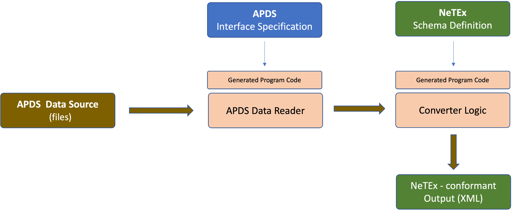

[](/LICENSE)
# netex-producer
an Open-Source APDS-to-NeTEx Adapter

## Starting Point and Motivation
### APDS
With the input of numerous parking industry professionals, the _Alliance for Parking Data Standards_ (https://www.allianceforparkingdatastandards.org) has created the APDS standard. The latest version of the standard specification is v3.0. The _Alliance_ also provides an accompanying APDS Messaging Specification (published on GitHub) to facilitate implementation work for APDS adopters.

### NeTEx, NeTEx Parking Profile
There is a variety of other specifications covering selected aspects of transport and mobility. One such standard specification is Transmodel (EN 12896, http://www.transmodel-cen.eu ), the CEN reference data model for public transport. Transmodel has also been the basis for NeTEx (“Network Timetable Exchange”, http://netex-cen.eu ) which constitutes a CEN Technical Standard for exchanging Public Transport schedules and related data (CEN TS 16614-1, CEN TS 16614-2, CEN TS 16614-3).

There are some profiles using a subset of NetEx. One of them is “NeTEx – Profil Français pour les Parkings”. It is related to parking facilities as one important element in the greater scheme of transport modes. It originally was created to serve as a basis for 3rd parties who are mandated to fulfill the French LOM (Lois d’Orientation pour les Mobilités), a national regulation.

### APDS-to-NeTEx Adapter
The sheer number of mobility-related standards and specifications makes it difficult for potential adopters to select the one that best matches their individual requirements, and most of the time, no information is available elaborating on the reciprocal representability between two different standards.

The subject of this project is precisely this: a software to convert information available in the APDS Messaging Specification format into its corresponding NeTEx (Parking Profile) representation. That way, implementers can safely base their work on APDS and know that it can be converted into a format processible by NeTEx endpoints (e.g. National Access Points expecting NeTEx-formatted data).

## Reference Documents
### APDS
Concerning the APDS standard, the proposed work will be based on the contents of the GitHub repository published at https://github.com/parkingdata/spec.

### NeTEx
Copies of the NeTEx specifications that this project is based on can be found in this repository:
* [NF_Profil-NeTEx-pour-les-ParkingsF-v1.1.pdf](/specs/NF_Profil-NeTEx-pour-les-ParkingsF-v1.1.pdf)
* [Profil-NeTEx-elements-communsF-v2.2.pdf](/specs/Profil-NeTEx-elements-communsF-v2.2.pdf) _(only the elements used in the Parking Profile)_

## Project Artefacts
This project provides two main artefacts:
* a Java library which you can use to translate between APDS and NeTEx (Parking Profile)
* a command line utility using the library, primarily meant to demonstrate usage of the adapter library

## License
This project is provided under the GPL v3 (GNU General Public License, version 3 dated 29 June 2007). A copy of the full LICENSE can be found [here](/LICENSE). Please note that the _NeTEx_ specifications used here are provided under GPL v3, too.

## Documentation
### Solution Architecture
The technical approach is this: 
* read APDS schema (OpenAPI) ⇨ generate corresponding Java objects to represent the APDS model (using the _openapi-generator_ maven plugin)
* read NeTEx schema definition (XSD) ⇨ generate corresponding Java objects  to represent the NeTEx model (using the _jaxb_ maven plugin, better known as the _xjc_ command line tool)
* connect both via programmed transformation logic
* use the automatically generated JAXB classes to serialize the NeTEx-conformant output


Via this approach, schema conformity is ensured to a great extent. Even though the project is using a sub-set of the NeTEx schema, the output will always successfully validate against the official full-blown _NeTEx\_publication.xsd_. 
In our project, we use open source tools to confirm this. Given an output file named "converter\_output.xml", this can be done like this: 

### Validation of the Result
```
 xmllint --noout --schema NeTEx_publication.xsd converter_output.xml

```

This is expected to generate a response output like this one here: 

```
 xmllint: converter_output.xml validates

```

### Build Instructions
#### Building the Library
The library itself is based on _Java_ source code. We have chosen _Maven_ as the build tool, but this can easily be changed to a different tool of your choice (like. e.g. _Gradle_). The .jar file with the library can be built in three simple steps.

##### Step 1: Generate Java Source Code from APDS Specification
```
 mvn generate-sources

```

##### Step 2: Generate Java Source Code from NeTEx XML Schema
```
 mvn jaxb2:xjc

```

##### Step 3: Compile Generated Code and Transformation Logic into Library
```
 mvn package

```


#### Building the Command Line Utility
The command line utility project uses the publicly-available version of the library. It can be found on [Maven Central](https://search.maven.org/). Obviously, you can also use a self-compiled (and potentially adjusted) version of your own. Like the library itself, the utility is based on the _Java_ programming language, and it comes with _Maven_ build specifications.

```
 mvn package

```

### Running the Command Line Utility
A typical run of the command line utility will look like this:

```bash
java -jar converter.jar --accesstoken=ENDPOINT_ACCESSTOKEN --place=805431 --output=converter_output.xml

```
(where _ENDPOINT_ACCESSTOKEN_ is a pre-shared secret to read data from the configured datasource)

This will 
* start the command line utility,
* query data for the place with id "805431" from an APDS-conformant endpoint (such as e.g. the UK NPP Pilot),
* convert the received information to a NeTEx-conformant format
* and write the result into a file named "converter_output.xml"


<br/>
<br/>
<hr/>
<br/>
<br/>

### Working Principle
<br/>

<hr/>
<br/>
<br/>

### Validation
<br/>

